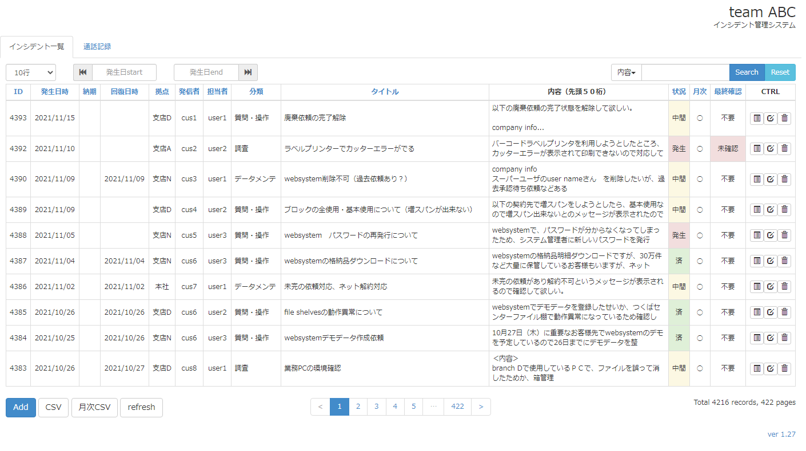
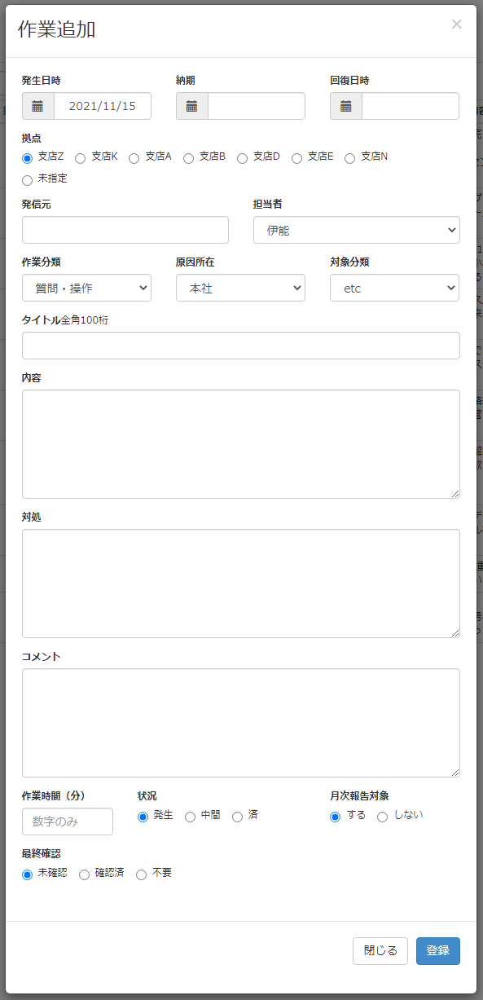

MameReception
=============

## 개요
팀 내에서 사용중인 작업관리 시스템입니다. 개인 프로젝트로 시작해서 팀 내 작업 관리 표준으로 정착되었습니다. 계열사의 작업관리 툴이 별도 존재하나 팀 특성에 맞지 않았고 시스템이 필요 이상으로 복잡한 점, 종래의 작업 형태에 맞추기 위해 추가 작업이 발생하는 등 단점이 많았으므로 2013년부터 우리의 사정에 맞게 만들기 시작한 이 툴을 2022년 현재에도 사용하고 있습니다.

## 기능
* 작업 추가, 수정, 삭제(의뢰일, 납기일, 종류, 작업자, 의뢰자, 지점 종류, 작업 상태, 상세 내용, 월간 보고 유무 등)
* 작업 검색
* 월간 보고서 기본 자료(CSV) 생성

## 의의
1. 엑셀 파일에서 관리하던 기존의 작업 관리 절차를 웹 시스템화 함.
2. 작업 기록을 데이터베이스로 만들어 활용 가능하게 함.(검색, 노하우 축적, 패턴 분석 등에 사용)
3. SPA 작성 스킬 습득에 도움이 됨.

## 환경
* jquery 1.10
* jquery BlockUI plugin
* twitter bootstrap 3.0
* Adobe ColdFusion (8,12,2021) || Railo (2+)
* mysql 5.0+
* NOT SUPPORT IE!!!

## 스크린샷
기본 화면

작업 추가 및 수정 화면

## TODO LIST
* 入力項目に「関連リンク」を追加する。
* 担当者フィルター
* アラーム：状況別作業数を表示するバナー
* アラーム：納期到来の作業をトップに表示する。
* IP検証
* 変更履歴保存
* メール
* システム設定（メールやDBなど）

## change log
* ver 1.27
  - 項目「最終確認」を追加しました。

* ver 1.26
  - プリント時にメッセージとタイトルが重なって表示される問題を修正（土居）

* ver 1.25 (2018/06/13)
  - バージョンの数字にリンクをつけ、変更履歴をmodalに表示
  - 「顧客情報」削除
* ver 1.24
  - 「顧客一覧」タブ削除

* ver 1.23
  - 検索機能：「タイトル」検索追加

* ver 1.22
  - 検索機能不具合修正

* ver 1.21
  - タイトル、内容、対処、コメントの「\」文字エスケープ

* ver 1.20
  - 一覧項目「納期」を「回復日時」に変更

* ver 1.19
  - axios.jsをローカル化

* ver 1.18
  - 「作業詳細」
    - feat 1. ID表示追加、タイトル表示位置変更
    - feat 2. ESCキー、モダル外部クリックで閉じる機能を無効化
    - feat 3. 拠点「未指定」追加
    - その他) 印刷時、スクロールバー未表示

* ver 1.17 「通話記録」
  - 一覧更新時、画面ブロック機能追加
* ver 1.16
  - 「通話記録」のインシデント番号に作業詳細リンクを追加
「通話記録」の通話時間を60分から120分に拡張
* ver 1.15
  - 「通話記録」のインシデント番号選択機能追加

* ver 1.14
  - 「通話記録」追加

* ver 1.13
  - 一覧に「納期」フィールド追加

* ver 1.12
  - 作業詳細画面の印刷機能追加
  - 拠点E追加
* ver 1.11 (2017/05/10)
  - 月次CSVの形式を報告書の形式と合わせました。
  - その他不具合修正
* ver 1.1
  - 月次CSVダウンロード機能を追加しました。

* 2014/01/21
  - 検索inputで、enterキー押下が認識できるように修正しました。

* 2014/01/18
  - merge dev -> master
  - 作業内容、対処を`pre`タグに入れました。
  - 作業詳細のmarginを調整しました。
  - 一覧更新時、ブロックします。

* 2014/01/17
  - dev branchを作成しました。
  - 一覧行数select機能を作成しました。
  - paginationを改善しました。
  - tabを適用しました。

* 2014/01/15
  - 検索の基本項目を「内容」に変更しました。

* 2014/01/10
  - リストの件数が0の場合、csvボタンは無効化します。
  - 「発生日start」「発生日end」入力欄を追加しました。(datepicker)作業発生日の範囲指定ができます。

* 2014/01/08
  - 「getCSV」ボタンを「CSV」ボタンに変更しました。
  - csvダウンロード機能を追加しました。
  - アクションボタン（add、csv、refresh）の位置をテーブルの下に変更しました。

* 2014/01/07
  - 検索機能追加しました。
  - 作業詳細の「内容」「対処」「コメント」のフォントを変更しました。

* 2014/01/06
  - 並べ替えの矢印を追加しました。

* 2013/12/24
  - 並べ替え機能を追加しました。
  
* 2013/12/20
  - ロゴイメージを追加しました。
  - ページ制御を変更しました。ページNoを10個表示します。
  - 作業詳細modalを追加しました。